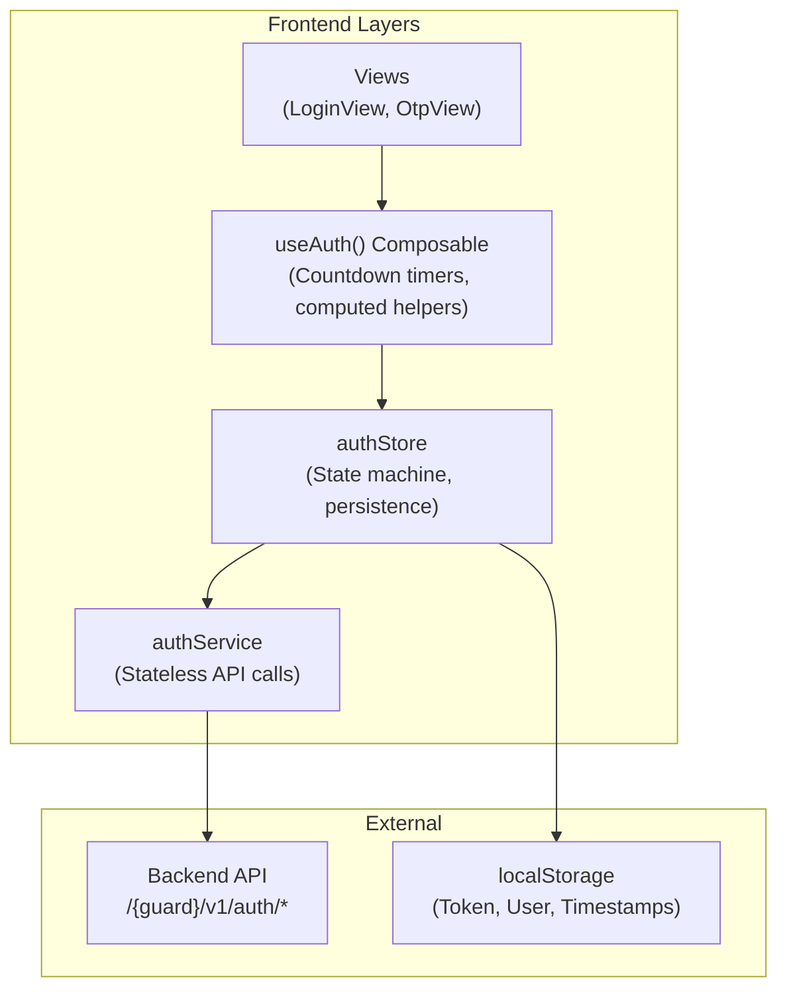
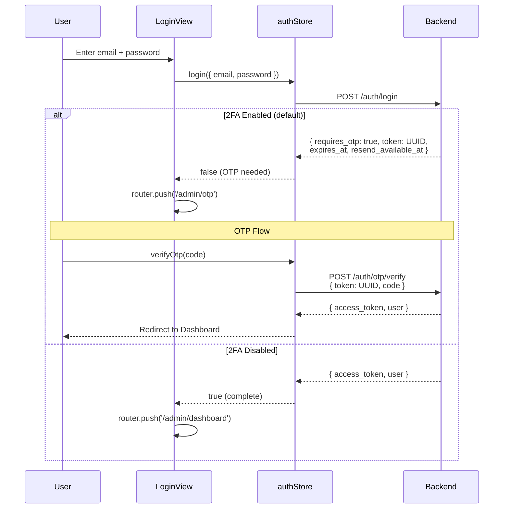

# Authentication

The authentication system provides a complete, multi-step login flow with two-factor authentication (2FA), OTP verification, session management, and password reset capabilities.

## Architecture Overview



## Login Flow



## Token-Based OTP Model

When 2FA is enabled, login returns an **OTP challenge** instead of an access token:

```json
{
  "success": true,
  "data": {
    "token": "a1b2c3d4-e5f6-4789-abcd-ef0123456789",
    "expires_at": "2026-04-15T12:05:00Z",
    "resend_available_at": "2026-04-15T12:01:00Z",
    "locked_until": null,
    "requires_otp": true
  }
}
```

| Field | Description |
|---|---|
| `token` | UUID used for `/otp/verify` and `/otp/resend`. Old tokens are invalidated on resend. |
| `expires_at` | When the OTP code expires. After this, the user must request a new code. |
| `resend_available_at` | Cooldown until the next resend is allowed (progressive: 1m → 5m → 15m → 1h → 24h). |
| `locked_until` | If set, the account is temporarily locked. All operations are blocked until this time. |

## Countdown Timers

The `useAuth()` composable provides **server-driven countdown refs** that tick every second:

```vue
<script setup>
const {
  otpExpiryCountdown,    // seconds until code expires
  otpResendCountdown,    // seconds until resend is available
  otpLockCountdown,      // seconds until lock expires
  canResendOtp,          // boolean — true when cooldown elapsed
  isOtpExpired,          // boolean — true when code has expired
  isOtpLocked,           // boolean — true when account is locked
  otpExpiryDisplay,      // formatted "4:32"
  otpResendDisplay,      // formatted "0:45"
  otpLockDisplay,        // formatted "14:59"
} = useAuth()
</script>

<template>
  <p v-if="otpExpiryCountdown > 0">
    Code expires in {{ otpExpiryDisplay }}
  </p>
  <button :disabled="!canResendOtp" @click="resendOtp">
    Resend {{ otpResendCountdown > 0 ? `(${otpResendDisplay})` : '' }}
  </button>
</template>
```

Countdowns **auto-start** when OTP timestamps are set (after login or resend) and **auto-stop** when all reach zero or the composable is unmounted.

## Cooldown & Lockout Rules

The backend enforces progressive cooldowns on OTP resend:

| Attempt | Cooldown |
|---------|----------|
| 1st     | 1 minute |
| 2nd     | 5 minutes |
| 3rd     | 15 minutes |
| 4th     | 1 hour |
| 5th+    | 24 hours |

If `locked_until` is set, the OTP view disables all inputs and shows a lock message with the remaining time.

## API Endpoints

All endpoints are prefixed with `/{guard}/v1/auth/`:

### Public Endpoints

| Method | Endpoint | Description |
|--------|----------|-------------|
| `GET`  | `/config` | Returns auth configuration for the guard |
| `POST` | `/login` | Authenticate with credentials |
| `POST` | `/otp/verify` | Verify OTP code (token-based) |
| `POST` | `/otp/resend` | Resend OTP code (returns new token) |
| `POST` | `/password/forgot` | Request password reset OTP |
| `POST` | `/password/verify-otp` | Verify password reset OTP |
| `POST` | `/password/reset` | Set new password with reset token |

### Protected Endpoints

| Method | Endpoint | Description |
|--------|----------|-------------|
| `GET`  | `/me` | Get authenticated user profile |
| `POST` | `/logout` | Revoke bearer token |
| `POST` | `/password/change` | Change current password |
| `PUT`  | `/2fa/toggle` | Enable/disable two-factor auth |

## Environment Variables

The auth system is **env-driven** — the frontend works without the backend config endpoint:

```env
# ─── Auth API Configuration ──────────────────
VITE_AUTH_GUARD=admin                     # Guard scope (admin | user)
VITE_AUTH_API_VERSION=v1                  # API version prefix

# ─── Auth Method ─────────────────────────────
VITE_AUTH_LOGIN_METHOD=email_password     # Login method
VITE_AUTH_2FA_ENABLED=true               # Two-factor authentication

# ─── OTP Configuration ──────────────────────
VITE_AUTH_OTP_DRIVER=system              # OTP driver (system | totp)
VITE_AUTH_OTP_CHANNEL=mail               # OTP channel (mail | sms)
VITE_AUTH_OTP_LENGTH=6                   # OTP code length

# ─── Session ────────────────────────────────
VITE_AUTH_SESSION_TTL=360                # Token TTL in minutes (0 = no expiry)

# ─── Mock Auth (Development) ────────────────
VITE_MOCK_AUTH=true                      # Enable mock auth (bypass API)
VITE_MOCK_AUTH_EMAIL=admin@neop.com      # Mock valid email
VITE_MOCK_AUTH_PASSWORD=password         # Mock valid password
```

### Mock Auth Behavior

When `VITE_MOCK_AUTH=true`:
- Login validates against `VITE_MOCK_AUTH_EMAIL` and `VITE_MOCK_AUTH_PASSWORD`
- If `VITE_AUTH_2FA_ENABLED=true`, login returns a **mock OTP challenge** with realistic timestamps
- Any 6-digit code passes OTP verification
- Resend generates a new mock token with updated timestamps
- Set `VITE_AUTH_2FA_ENABLED=false` to skip OTP during development

## File Structure

```
src/
├── config/auth.ts         # Environment-driven auth defaults
├── types/auth.ts          # TypeScript interfaces for all auth flows
├── services/auth.ts       # Stateless API calls + mock handlers
├── stores/authStore.ts    # Pinia store — state machine & persistence
├── composables/useAuth.ts # View-facing composable — countdown timers
└── views/admin/auth/
    ├── LoginView.vue      # Credentials form
    ├── OtpView.vue        # OTP verification with countdowns
    ├── ForgotPasswordView.vue
    ├── ForgotPasswordOtpView.vue
    └── ResetPasswordView.vue
```
