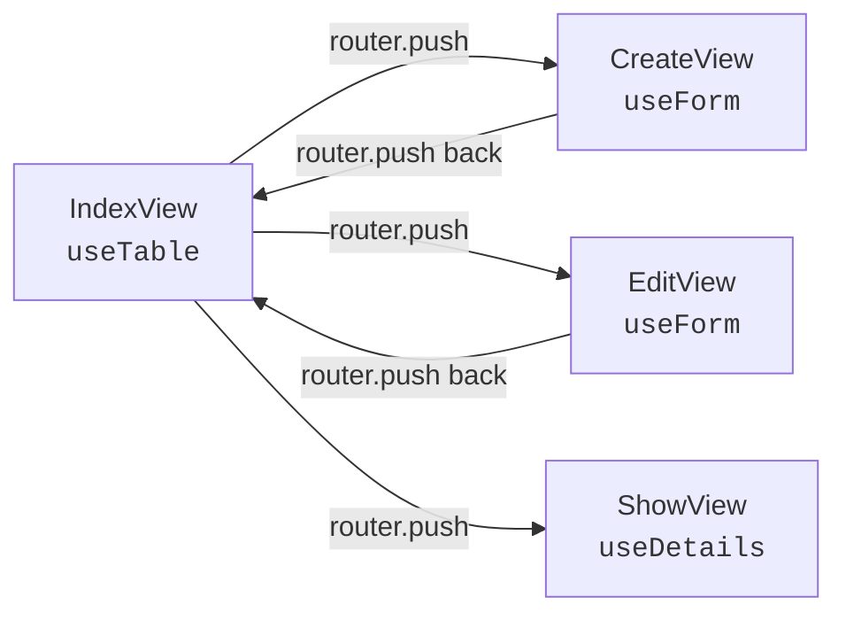

# Modular Composable System

> [!TIP] Quick Start: Scaffold a Module
> You can automatically generate a full module (including fields, schema, columns, views, and routing) by running:
> ```bash
> bun run make:module
> ```

The Neop Dashboard Framework offers two ways to build resource-driven pages:

1. **The Classic Approach:** Using `useResource` and `<ResourcePage />`. Great for getting a complete CRUD interface up and running in minutes, but rigid for custom layouts.
2. **The Modular Approach:** Using two independent composables — `useTable` and `useForm` — wired together with standard Vue Router navigation.

## Why the Modular Approach?

While `<ResourcePage />` handles 90% of use cases, you'll want the modular approach when:

- You want the table on one page and the form on completely different routes.
- You need a heavily customized layout that doesn't fit the standard table-with-modal pattern.
- You want to use external form libraries like `vee-validate` instead of the built-in form state.
- You only need a table (without forms) or only a form (without tables).

## The Two Pillars

The system consists of two core composables that can be used alone or combined:

### `useTable`

Handles everything related to table data.

- Data fetching & caching (via TanStack Query)
- Pagination, Sorting, Search
- Dynamic Filters & Column visibility
- Row selection & Bulk actions
- **Built-in delete** with confirmation dialog and auto-refresh
- [Read the full guide →](./use-table)

### `useForm`

Handles form state and mutations.

- Data binding & field management
- Create and update mutations
- Zod schema validation OR fallback to field validation
- Extensible API error handling & file uploads
- [Read the full guide →](./use-form)

### Supporting Composables

| Composable | Purpose |
|---|---|
| [`useDetails`](./use-details) | Read-only entity detail view with caching |
| `useConfirm` | Standalone confirmation dialog state (also built into `useTable`) |
| `useCan` / `v-can` | Permission checks |

## Module File Structure

When you scaffold a module, the configuration files live in `src/modules/<resourceName>/`:

```
src/modules/products/
├── schema.ts          # Zod validation schema
├── columns.ts         # Table column definitions
├── fields.ts          # Form field configurations
├── endpoints.ts       # API endpoint constants
└── index.ts           # Route registration (registerModule)
```

Views live separately in `src/views/admin/<resourceName>/`:

```
src/views/admin/products/
├── IndexView.vue      # Table listing
├── CreateView.vue     # Create form
├── EditView.vue       # Edit form
└── ShowView.vue       # Read-only detail view
```

## How It All Connects

The modular system uses **standard Vue Router navigation** as the glue between views — no orchestrator composable needed:



Each view owns its own composable. No cross-composable wiring needed.

## View Mode Control

The `<ModularView>` wrapper component enables automatic modal/full-page rendering based on route meta:

```ts
// In your route registration
{
  path: 'create',
  name: 'admin-products-create',
  component: () => import('./CreateView.vue'),
  meta: { openMode: 'modal' }  // or 'full'
}
```

- `meta: { openMode: 'modal' }` → Sub-page renders in a `<POV>` dialog overlay
- `meta: { openMode: 'full' }` → Sub-page renders as a full page

No composable configuration needed — just set the route meta.

## Route Registration

Every module needs to be connected to the Vue Router in two steps:

### 1. Create the module file

At `src/modules/<resourceName>/index.ts` using `registerModule()`:

```ts
import { registerModule } from '@/router/modules'
import { Home01Icon } from '@hugeicons/core-free-icons'

registerModule({
  name: 'products',
  path: 'admin/products',
  icon: Home01Icon,
  permissionKey: 'products',
  routes: [
    {
      path: 'admin/products',
      name: 'admin-products',
      component: () => import('@/views/admin/products/IndexView.vue'),
      meta: { breadcrumbKey: 'menu.products' },
      children: [
        {
          path: 'create',
          name: 'admin-products-create',
          component: () => import('@/views/admin/products/CreateView.vue'),
          meta: { openMode: 'modal' }
        },
        {
          path: ':id/edit',
          name: 'admin-products-edit',
          component: () => import('@/views/admin/products/EditView.vue'),
          meta: { openMode: 'modal' }
        },
        {
          path: ':id',
          name: 'admin-products-show',
          component: () => import('@/views/admin/products/ShowView.vue'),
          meta: { openMode: 'full' }
        }
      ]
    }
  ]
})
```

### 2. Import it in the router

In `src/router/index.ts`:

```ts
import '../modules/products'
```

The import triggers `registerModule()`, and the router picks up the routes automatically via `getModuleRoutes()`.

## Permissions

Use the existing permission system directly — no wrapper needed:

```vue
<!-- In templates: v-can directive -->
<Button v-can="'products.manage'" @click="...">Add Product</Button>

<!-- Or use the component wrapper for fallback UI -->
<PermGuard permKey="products.manage">
  <Button @click="...">Add Product</Button>
</PermGuard>
```

The `permissionKey` on `registerModule()` auto-injects `meta.permission` on all routes, enforcing access at the router guard level.

## Sidebar Navigation

Add your module to the sidebar in `src/lib/navigation.ts`:

```ts
import { ShoppingBag02Icon } from '@hugeicons/core-free-icons'

// In navigationConfig array:
{
  name: 'products',
  label: 'menu.products',       // i18n key
  icon: ShoppingBag02Icon,
  to: '/admin/products',
  permission: 'products.view',  // optional permission gate
}
```

Then add the i18n keys:

- `src/i18n/locales/en/menu.json`: `"products": "Products"`
- `src/i18n/locales/ar/menu.json`: `"products": "المنتجات"`

## Getting Started

To learn how to build a complete module step-by-step, check out the [Building a Module Guide →](./building-a-module).
